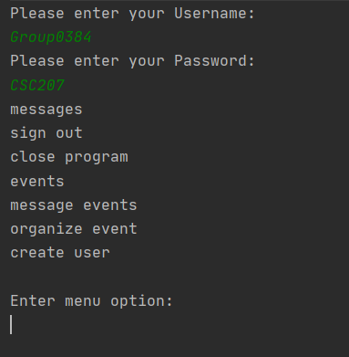

## CSC207 Project Phase 1
Navigate your social conference easily with our text-based communication software.

## Screenshots

## Features
- Fully functional login system
- Interactive event functionalities
- Displayed conference events sortable by title, time, and speaker
- Intricate and easy-to-use messaging system

## How to use?

###1. Opening and running the main class
Open up the program and locate and open the folder labelled src. Locate the class called main and right click it and then click run Main.main().  
**PLEASE NOTE: Every item in the main is CASE SENSITIVE and will be changed for Phase 2**

###2. Using the program on startup
When run, the user will be prompted to enter a username followed by a password. 
For simplicity purposes, we have already encoded 3 different accounts for the
user to run. 
* For an Organizer, please enter the following account:  
(Username: Group0384O, Password: CSC207).
* For a Speaker, please enter the following account:  
(Username: Group0384S, Password: CSC207).
* For an Attendee, please enter the following account:  
(Username: Group0384A, Password: CSC207).
    
####2.1 - Using the program as an Organizer
After opening up the program as an organizer, you will see a dropdown menu with the following options:  
- messages
- sign out
- close program
- events
- organize event
- create user

#####2.1.1 - messages
When calling messages, the organizer will get the following dropdown:  
- Back
- Display all messages
- Message all speakers
- Message a specific speaker
- Message all attendees
- Message a specific attendee

######2.1.1.1 - Back
Going back to the previous screen will return you to the dropdown shown in 2.1

######2.1.1.2 - Display all messages
This function will display all the messages that have been sent to the user

######2.1.1.3 - Message all speakers
This function will send a message to every user that is registered as a speaker.
Upon entering the function, you will be prompted to enter the content of the message to all speakers.
After writing your message, click the enter key, the message will be sent and you will be returned to the main menu
that is displayed in 2.1.

######2.1.1.3 - Message a specific speaker
This function will send a message to a specific user that is registered as a speaker.
Upon entering the function, you will be prompted to enter the username of the speaker you are trying to contact.
Next, you will be asked to enter the 

## Credits
- Ananya Jha: ananya.jha@mail.utoronto.ca
- Divij Sanjanwala: divij.sanjanwala@mail.utoronto.ca
- Hayden Wolff: hayden.wolff@mail.utoronto.ca
- Marko Bachvarovski: marko.bachvarovski@mail.utoronto.ca
- Roger Lam: roge.lam@mail.utoronto.ca
- Sannat Bhasin: sannat.bhasin@mail.utoronto.ca
- Shiven Taneja: shiven.taneja@mail.utoronto.ca
- Wayne Zhu: waynez.zhu@mail.utoronto.ca